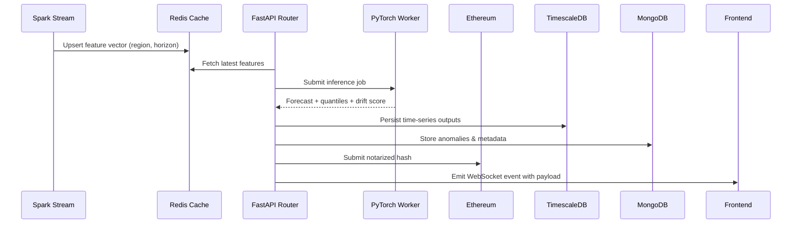

# Decentralized Energy Forecasting – Architecture

## 1. High-level Architecture Diagram

```mermaid
flowchart LR
    subgraph Edge["Edge & Field Devices"]
        MQTT[Meters & DER IoT]
        Weather[Weather Stations]
    end

    subgraph Streaming["Streaming & Processing"]
        Kafka[(Kafka Topics)]
        Spark[Apache Spark Streaming\nData Enrichment]
        FeatureStore[(Feature Store\n(TimescaleDB + Redis))]
    end

    subgraph AI["AI & Inference"]
        Trainer[Model Training\n(LSTM + PyTorch)]
        Registry[(Model Registry)]
        Inference[FastAPI Inference\nGPU Workers]
    end

    subgraph Persistence["Persistence Layer"]
        Timescale[(PostgreSQL/TimescaleDB)]
        Mongo[(MongoDB)]
        Ledger[(Ethereum / Hyperledger)]
    end

    subgraph API["API Gateway & Services"]
        FastAPI[FastAPI Core API]
        Websocket[WebSocket Stream]
        Auth[OIDC / Wallet Auth]
    end

    subgraph Frontend["Analytics & UX"]
        NextDashboard[Next.js + Tailwind\nAnalytics Dashboard]
        Wallet[Web3.js / ethers.js\nWallet Adapter]
    end

    MQTT -->|Telemetry| Kafka
    Weather -->|Weather Features| Kafka
    Kafka --> Spark
    Spark --> FeatureStore
    FeatureStore --> Inference
    Trainer --> Registry --> Inference
    Inference --> Timescale
    Inference --> Mongo
    Inference --> FastAPI
    FastAPI --> Websocket
    FastAPI --> Ledger
    Ledger --> FastAPI
    FastAPI --> NextDashboard
    Websocket --> NextDashboard
    Wallet --> Ledger
    Wallet --> Auth
```

## 2. Component Overview

- **Edge Telemetry**: DER controllers, smart meters, and weather stations publish telemetry over MQTT / OPC-UA. Lightweight agents handle buffering and secure TLS transport.
- **Kafka Ingestion**: Topics segmented by asset class (`solar`, `wind`, `storage`), ingesting millisecond timestamped payloads for Spark processing.
- **Spark Streaming**: Structured Streaming jobs normalize units, join with reference data, compute derived features (irradiance, forecast horizon, ramp rates), and push curated streams into the feature store.
- **Feature Store**: TimescaleDB retains time-series features; Redis caches hot features for inference. MongoDB stores asset metadata, anomaly logs, and UI-specific aggregates.
- **Model Training**: PyTorch LSTM ensembles trained offline with hyperparameter sweeps. Model artifacts versioned in a registry (e.g., MLflow) and promoted through staging gates.
- **Model Serving**: FastAPI service orchestrates GPU-backed inference workers, retrieving features, performing ensemble predictions, computing quantiles, and publishing results downstream.
- **Blockchain Layer**: Smart contracts (Ethereum or Hyperledger) notarize forecast hashes, manage staking/incentive pools, and handle automated settlement for deviations.
- **API Gateway**: FastAPI exposes REST and WebSocket endpoints for forecasts, anomalies, and blockchain transaction status. OAuth2 or wallet-based auth ensures secure access.
- **Frontend Dashboard**: Next.js/Tailwind UI displays real-time charts, DER performance, forecast accuracy, and wallet settlement flows. WebSockets stream live forecast updates.

## 3. Data Flow

1. **Ingestion** – Edge devices push telemetry to Kafka.
2. **Processing** – Spark Streaming processes telemetry, writing enriched data into TimescaleDB and publishing inference batches to Redis.
3. **Inference** – FastAPI pulls features, executes LSTM inference, stores results in TimescaleDB/MongoDB, and emits WebSocket events.
4. **Settlement** – Forecast hashes and deviation penalties submitted on-chain via ethers.js, enabling transparent auditing.
5. **Analytics** – Frontend consumes REST + WebSocket feeds for dashboards, while operators interact with blockchain via MetaMask.

## 4. Microservices Breakdown

| Service | Responsibility | Tech |
| --- | --- | --- |
| `ingestion-gateway` | Collect telemetry from field, authenticate and push to Kafka | Python, FastAPI, Kafka |
| `streaming-processor` | Spark Structured Streaming jobs | PySpark, Delta Lake |
| `forecast-service` | Serve inference, expose REST & WS | FastAPI, PyTorch, Redis |
| `asset-service` | Manage asset registry and analytics | FastAPI, MongoDB |
| `settlement-service` | Interact with blockchain, manage incentives | FastAPI, ethers.js, Ethereum |
| `ui-gateway` | Next.js frontend | React, Tailwind, Vercel |

## 5. Blockchain Integration Workflow

1. Forecast results hashed (`keccak256`) with timestamp, region, and model version.
2. Settlement smart contract verifies signature of forecasting authority.
3. On deviation beyond threshold, contract triggers incentive redistribution from staking pool.
4. Wallet UI invokes contract methods via MetaMask, enabling operator overrides (e.g., dispute, recalibrate).
5. Hyperledger variant enables consortium governance with private data collections for regulated markets.

## 6. Real-time Spark Streaming Pipeline

```mermaid
flowchart LR
    Source[Kafka Source\nTelemetry Topic] --> Parse[Schema Registry Decode]
    Parse --> Enrich[Feature Engineering\n(weather, asset, market)]
    Enrich --> Window[Sliding Window Aggregations]
    Window --> Quality[Data Quality Rules & Alerts]
    Quality --> Sink1[(TimescaleDB)]
    Quality --> Sink2[(Redis Feature Cache)]
    Quality --> Sink3[(MongoDB Alerts)]
```

- **Latency**: < 2 seconds end-to-end.
- **Scaling**: Auto-scaling via Kubernetes + Spark Operator.
- **Resilience**: Checkpointing to HDFS/S3 for exactly-once semantics.

## 7. FastAPI Endpoints

- `GET /api/v1/forecasts/summary` – Current forecast accuracy, horizon, asset counts.
- `GET /api/v1/forecasts/latest` – Latest rolling window of forecast vs actual data.
- `GET /api/v1/assets/performance` – Asset-level performance and deviation metrics.
- `GET /api/v1/alerts/recent` – Recent grid alerts triggered by streaming quality rules.
- `POST /api/v1/settlements/notarize` – Publish forecast hash to blockchain.
- `GET /api/v1/settlements/{tx_hash}` – Retrieve blockchain settlement status.
- `WebSocket /ws/forecasts` – Stream forecast points + alerts to frontend.

## 8. Model Inference Flow



## 9. Deployment Architecture (Docker + Kubernetes + CI/CD)

- **Containerization**
  - `frontend/Dockerfile` – Multi-stage Next.js build.
  - `backend/Dockerfile` – FastAPI + Uvicorn + PyTorch runtime.
  - `streaming/Dockerfile` – Spark job packaged with dependencies.
  - `blockchain/Dockerfile` – Hardhat node for testing/deployment.
- **Orchestration**
  - Kubernetes manifests in `k8s/` for deployments, services, ingress, secrets.
  - Spark Operator manages streaming jobs; Horizontal Pod Autoscaler on API.
  - Istio or NGINX ingress for routing, cert-manager for TLS.
- **CI/CD**
  - GitHub Actions build & test pipeline:
    - Lint + unit tests for frontend/backend.
    - Docker build & push to registry.
    - Helm upgrade or `kubectl apply` with image digest promotion.
    - Vercel deployment for frontend after integration tests.
- **Observability**
  - Prometheus & Grafana dashboards for API latency, model drift, and chain tx status.
  - ELK stack for log aggregation; OpenTelemetry tracing across services.

